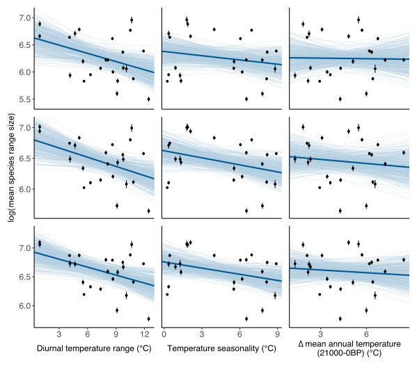

# Main figures

  
Figure 1. Spatial distribution of the 37 mountain locations used in the study. The size of the dots is proportional to the number of species in each location. In red, elevational gradients between 2000 m and 2500 m; in blue, elevational gradients ≥ 2500 m.

 

  
Figure 2. Relationships between the mean species’ elevational range size and diurnal temperature range (A), temperature seasonality (B) and the variation of mean annual temperature in the last 21,000 years before present (C). Points represent the estimated mean elevational range sizes with their respective standard error in each of the 33 standardized transects ≥ 2500 m. Thick lines are the posterior mean calculated from 400 random draws sampled from the 95% credible interval (thin blue lines).

 

  
Figure 3. Results from the analyses investigating the responses of species’ elevational range sizes to diurnal temperature range (A) and temperature seasonality (B) within each 38 sites used in the study. Histograms are of mean slope terms divided by their standard deviation from the 95% credible interval for the mountain-specific analyses. Colors indicate whether the 95% credible interval includes 0 or not. Dashed lines indicate 0.

# Figures for the appendix

## Broad-scale analyses

  
S1. Posterior distributions for DTR, TS, ∆MATlgm (standardized transect length = 2500 m; exclusion zone = 250 m; singleton threshold ≤ 25%).

 

  
S2. Names of each mountain location in figure 2.

 

  
S3. Same as figure 2 with standardization from the bottom of each transect.

 

  
S4. Response of species’ elevational range size to DTR, TS and ∆MATlgm with standardized transects length set to 2000 m. Top row: no exclusion zone; middle row: exclusion zone = 250 m; bottom row: exclusion zone = 500 m.

 

  
S5. Same as S4 with standardized transects length set to 2500 m. Top row: no exclusion zone; middle row: exclusion zone = 250 m; bottom row: exclusion zone = 500 m.

 

  
S6. Same as S4 with standardized transects length set to 3000 m. Top row: no exclusion zone; middle row: exclusion zone = 250 m; bottom row: exclusion zone = 500 m.

## Mountain-specific analyses

  
S7. Same as figure 3 with exclusion zone set to 0.